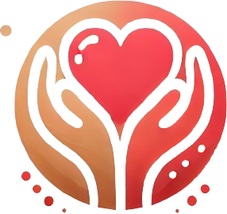

<a id="readme-top"></a>
<!-- TABLE OF CONTENTS -->
## Table of Contents
  <ol>
    <li>
      <a href="#about-the-project">About The Project</a>
      <ul>
        <li><a href="#built-with">Built With</a></li>
        <li><a href="#team-members">Team Members</a></li>
      </ul>
    </li>
    <li>
      <a href="#installation">Installation</a>
      <ul>
        <li><a href="#clone">Clone</a></li>
        <li><a href="#project-setup">Project Setup</a></li>
        <li><a href="#test-account">Test Account</a></li> 
      </ul>
    </li>
  </ol>

<br/>
<br/>

## About The Project

<p align="center">
    
</p>

<p align=center>
    Our solution helps to seamlessly link elderly to planned events, via their guardians. By creating a minimal and simplified UI for the elderly, we empower them to easily indicate the events they are interested in. Their guardians then help the elderly person perform the more complicated tasks involved in signing up for the particular event(s), such as filling up long forms. Our solution also provides community event planners an additional avenue to find attendees to their events.
</p>

### Built With

* <a href="https://html.com/"></a>
* <a href="https://developer.mozilla.org/en-US/docs/Web/CSS"></a>
* <a href="https://www.javascript.com/"></a>
* <a href="https://vuejs.org/"></a>
* <a href="https://getbootstrap.com"></a>
* <a href=""></a>
* <a href=""></a>

<br/>

### Team Members

| Members               | School Email     | Email                           |
| --------------------- | ---------------- | ------------------------------- |
| Tan Sheng Da                   | shengda.tan.2021 | shengdatan@gmail.com            |
| Adam Bin Firdaus Tan         | adam.tan.2021 | adamft.2021@scis.smu.edu.sg   |
| Toh Ming Jun | mingjun.toh.2021 | mingjun.toh.2021@scis.smu.edu.sg|
| Goh Choon Shane            | csgoh.2021 | csgoh.2021@scis.smu.edu.sg   |
| Teo Jun Wee, Ryan          | ryanteo.2021  |  ryanteo.2021@scis.smu.edu.sg   |


<p align="right">(<a href="#readme-top">back to top</a>)</p>

## Installation

### Clone
Clone the github repository to your local machine by typing in the terminal `git clone https://github.com/tan-sd/event-aid.git`

### Project setup
```
cd event-aid
cd frontend

npm install
```

### Running Development Server
```
npm run dev
```

### Test Account
| **Username**       | **elderly1** OR guardian1 OR planner1 |
| -------------- | ------------------|
| **Password**       | **12345**  

<p align="right">(<a href="#readme-top">back to top</a>)</p>
